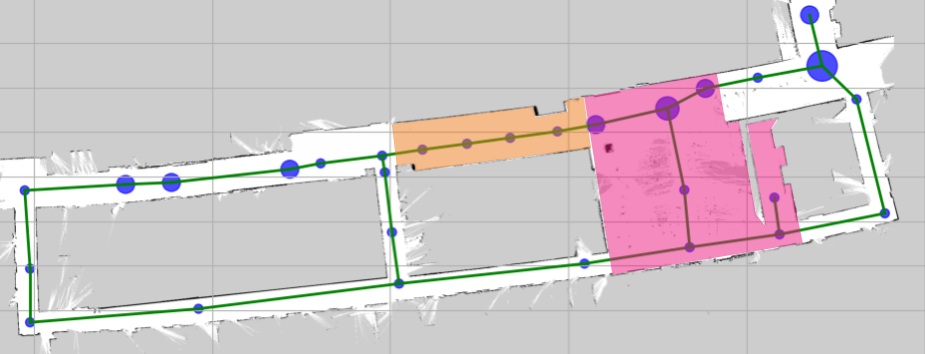
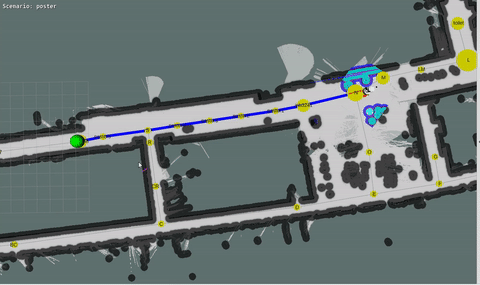
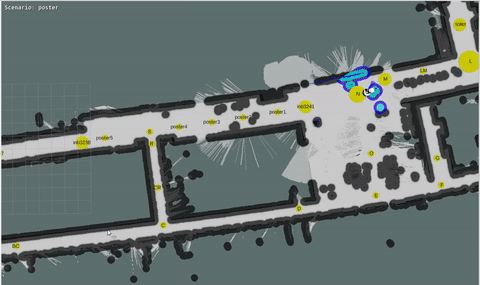
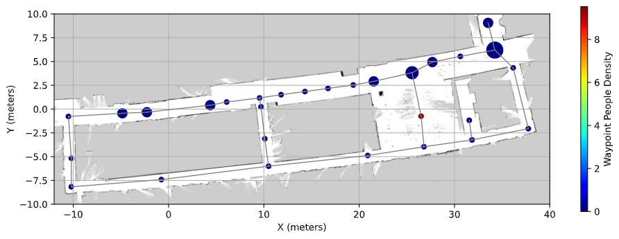
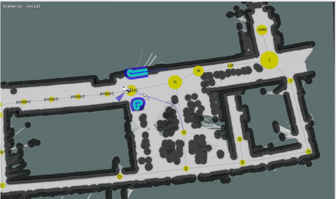

## Real-World Experiments

The framework was also evaluated in a real-world university setting. Two scenarios were staged to qualitatively test the effectiveness of our approach when deployed on a real TIAGo robot: a busy <strong>poster session in a corridor</strong> and a <strong>social event in a kitchen</strong>.

Twenty participants took part in the data collection for the learning pipeline of our causal framework.

### Scenario 1: Poster Session

#### Learning

<video controls width="640">
	<source src="static/videos/S1-learning-screen.mp4" type="video/mp4">
	Your browser does not support the video tag.
</video>

The data collected during the poster session was used to update the conditional probability distributions of the causal model (W → D ← S). The corridor waypoints used in the experiment had higher people density than other areas.

#### Inference

Robot Task: Navigate from the starting pink waypoint to the target green waypoint.

<table>
	<tr>
		<td style="vertical-align: top; padding-right: 12px;">
			
<strong>Non-causal approach (baseline)</strong>

			
		</td>
		<td style="vertical-align: top; padding-left: 12px;">
			
<strong>Causal approach (Our)</strong>

			
		</td>
	</tr>
</table>

The causal approach correctly identified the corridor as congested and chose a longer but clearer path, improving task success and safety.

### Scenario 2: Social Event

#### Learning

<video controls width="640">
	<source src="static/videos/S2-learning-screen.mp4" type="video/mp4">
	Your browser does not support the video tag.
</video>

Data from the social event (kitchen) was used to further update the model. The kitchen waypoint showed a higher concentration of people.

#### Inference

Robot Task: Navigate from the starting pink waypoint to the target green waypoint.

<table>
	<tr>
		<td style="vertical-align: top; padding-right: 12px;">
			
<strong>Non-causal approach (baseline)</strong>

			
		</td>
		<td style="vertical-align: top; padding-left: 12px;">
			
<strong>Causal approach (Our)</strong>

			
		</td>
	</tr>
</table>

Without causal reasoning the baseline attempts the shortest path through the crowded kitchen and often fails. The causal approach predicts the high people density and chooses a safer, more efficient alternative route.
